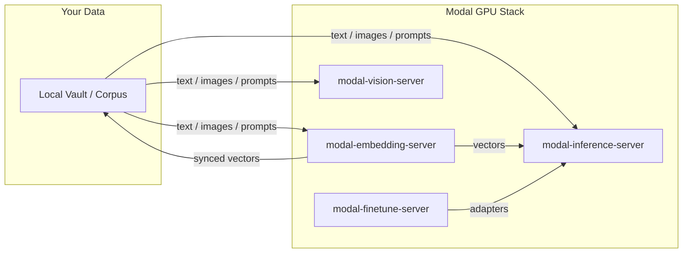

# Modal Finetune Server

A generic, production-tested **LoRA artifact pipeline: LoRA fine-tune → merge/GGUF → local eval** running on Modal GPUs. It builds and publishes artifacts (HF adapters, quantized GGUF); serving them is the inference package's job.

---

[](LICENSE)
[](https://www.python.org/)
[](#quick-start-the-flight-path)
[](https://github.com/sponsors/kylebrodeur)

---

## The Four Pillars

### 1. Profiles (`/profiles`): the recipe
Model-specific reference recipes distilled from working runs. Each `profile.json` records everything a run used: base model, LoRA rank/alpha/dropout, target/exclude regex modules, SFT hyperparameters, dtype, and publish targets. Nothing in `server/` or `eval/` loads `profile.json` at runtime: read it as documentation of proven settings, and apply the same values through the entrypoints' own arguments.

**The `gemma4` profile is extracted from three published adapters** (two published on HF Hub, one on Ollama), so the regex scoping and PEFT exclusion rules solve the tricky **`Gemma4ClippableLinear`** incompatibility that breaks naive PEFT setups. See [profiles/gemma4/README.md](profiles/gemma4/README.md).

Want a new architecture? Copy a profile as your reference, but expect to touch the training code: `server/train_modal.py` builds the LoRA config inline for the current base; there is no profile-loading layer to drop a config into.

### 2. Research (`/research`): the dataset
Domain-agnostic dataset prep. Accepts any of three input shapes (`messages`, `prompt`/`response`, or `text`), normalizes, dedupes, shuffles, and splits: so a "held-out eval" actually means held-out, not "the last 20 rows".

### 3. Server (`/server`): the pipeline
The Modal-hosted, end-to-end machinery:
- **`train_modal.py`**: LoRA SFT on Modal A10G, ~1 hr / <$2, pushes adapter straight to HF Hub.
- **`merge_modal.py`**: Merge LoRA adapter into the base model (for inference-ready artifacts).
- **`gguf_pipeline_modal.py`**: Merge → convert to GGUF → quantize on Modal. No local llama.cpp toolchain required.
- **Serving note:** this package does NOT host inference; the artifacts it publishes (HF adapters, GGUF) are served by the inference package.

### 4. Eval (`/eval`): the honesty gate
"The Well-Tuned gate": a fine-tune earns the label only if **TUNED >= BASE** on both JSON validity and a pluggable domain validator.

- **Generic validator** (default): output must contain a parseable JSON object.
- **Plugin validator**: pass `--validator dotted.path.to.validate` for your own schema/rules.
- **Sampled review**: it prints the raw samples so a human can verify "real judgment" by eye.

If it only parrots, you report that: a thin badge is worse than an honest no.

---

## Quick Start: The "Flight Path"

### Step 1: Prep a dataset
```bash
uv run python -m research.prep_dataset \
  --input your-raw-data.jsonl \
  --out-dir data/finetune \
  --eval-fraction 0.2
```

### Step 2: Train with a profile
```bash
modal run server/train_modal.py \
  --profile profiles/gemma4/profile.json \
  --push-to <hf-user>/<your-adapter-name>
```

### Step 3: Eval (base vs. tuned)
```bash
uv run python eval/run_eval.py \
  --base google/gemma-4-E4B-it \
  --adapter <hf-user>/<your-adapter-name>
```

### Step 4: (Optional) Convert + Quantize GGUF
```bash
modal run server/gguf_pipeline_modal.py \
  --adapter <hf-user>/<your-adapter-name> \
  --base google/gemma-4-E4B-it \
  --outtype q4_k_m
```

### Step 5: Serve it (via the inference package, not here)

This package builds artifacts; it does not host inference. Point the
inference package at the artifact and it serves with everything the LLM
pillar already has (model registry, GPU lanes, proxy, dashboard):

- **GGUF path:** register the merged/quantized model from Step 4 as an
  inference-server alias (`mci models add <alias> --runtime llama --model
  "hf.co/<user>/<gguf-repo>:<quant>" ...`) and deploy.
- **HF-adapter path:** the Step 3 adapter is already on the Hub
  (`push_to`); either merge first (Step 4) for any GGUF runtime, or serve
  it as a LoRA on a vLLM lane (`--enable-lora --lora-modules`).

Serving, warm/cold management, cost, and the dashboard are the
inference package's job; secrets for that deploy live in its manifest.

`server/secrets.toml` stays the source of truth for the secrets THIS
package needs (HF token for gated base models + Hub upload).

## Configuration

Training knobs via environment variables (prefixed with `MODAL_FINETUNE_`):

- `MODAL_FINETUNE_BASE`: The HF base model id (e.g., `google/gemma-4-E4B-it`).
- `MODAL_FINETUNE_GPU`: GPU class for the train job (e.g., `A10G`, `L4`, `H100`).

## Metrics (opt-in)

Set `MODAL_FINETUNE_METRICS=1` to push training and eval events into your own
VictoriaMetrics (or InfluxDB; same line protocol) via the vendored
`server/vm_metrics.py` (stdlib-only, never raises; shipped into the train
image with `add_local_file`). `MODAL_FINETUNE_VM_URL` picks the endpoint
(default `http://localhost:8428`); `MODAL_FINETUNE_DEVICE_TAG` labels each
point's `device` tag (fallback: the app name).

Emissions: `finetune_train_start` (tag `profile`), `finetune_train_seconds`
(tags `profile`, `status` = `done` | `error`), `finetune_gguf_done` (tag
`adapter`), `finetune_eval_done` (tag `verdict` = `well_tuned` |
`not_well_tuned`, the compact token form). With the env off, every emission
site is a no-op.

---

## Examples

See [`examples/`](examples/) for a minimal, stdlib-only client that trains a small adapter on toy data.

## Contributing

See [CONTRIBUTING.md](CONTRIBUTING.md) for ground rules and workflow.

---

Built by [Kyle Brodeur](https://kylebrodeur.com) · Model-selection deep-dive: [Choose the Right Embedding Model for Your Data](https://kylebrodeur.substack.com/p/choose-embedding-model-for-your-data)

---

## Lifecycle hooks

This package fires a lifecycle hook seam (vendored verbatim from
[modal-shared-libs](https://github.com/kylebrodeur/modal-shared-libs),
refreshed by `mtk libs sync`): one shared instance named
`modal-finetune-server`, closed tag set ``train.pre` / `train.post` / `eval.pre` / `eval.post` / `eval.verdict` / `gguf.pre` / `gguf.post``.

Pipeline stages: train.pre/train.post wrap the LoRA train run, eval.pre/eval.post wrap the eval gate (eval.verdict carries the verdict payload), gguf.pre/gguf.post wrap each GGUF conversion stage.

Register without touching the package source - the seam lives next to the
real stage boundaries; handler errors are contained and reported
(`last_errors(tag)`), never the server:

```python
from hooks_wiring import hooks


@hooks.on("eval.verdict")
def observe(payload): print(payload)
```

The tag set changes only in this package's releases.

## Operator commands (`mtk`)

This package ships an `mtk finetune` command group in
`server/mtk-commands.toml`; [modal-toolkit](https://github.com/kylebrodeur/modal-toolkit)
mounts it when this repo is present in the workspace. Each command runs a
Modal artifact-factory job:

- `mtk finetune train` — run a LoRA SFT training job (`modal run server/train_modal.py`).
- `mtk finetune eval` — run the honesty eval gate on a trained adapter.
- `mtk finetune gguf` — merge the adapter and export GGUF for the inference server.

## Part of the Modal Toolkit

Seven standalone Modal utilities from the same author, each extractable and deployable on its own.

- **[modal-embedding-server](https://github.com/kylebrodeur/modal-embedding-server):** GPU-backed embeddings with a monotonic sync protocol for private-first search.
- **[modal-inference-server](https://github.com/kylebrodeur/modal-inference-server):** OpenAI-compatible LLM inference with hot-set routing and scale-to-zero.
- **[modal-vision-server](https://github.com/kylebrodeur/modal-vision-server):** Generic vision classification: pick your model (open_clip or transformers weights), your segmenter (SAM 2.1 or none), and your fast gate (self, cheap CLIP, deterministic script, or external endpoint). The BioCLIP plant stack ships as the example card.
- **[modal-vault-server](https://github.com/kylebrodeur/modal-vault-server):** Hosted Obsidian vault + MCP memory plane: server-side clone via Headless Sync, searchable by MCP-speaking agents.
- **[modal-toolkit](https://github.com/kylebrodeur/modal-toolkit):** One operator CLI (`mtk`) that runs the fleet: `doctor`, `secrets`, `warm --all`, `shutdown --all`, `cost`, `flow`, `dashboard`.
- **[embed-eval-on-your-vault](https://github.com/kylebrodeur/embed-eval-on-your-vault):** the eval-first pattern (benchmark embedding models on your own data before you deploy) as a single-file, zero-dependency harness.

## Ecosystem Flowchart




## Built on Modal

These packages run on [Modal](https://modal.com), the serverless GPU platform. If you build something with them, share it in the [Modal Slack](https://modal.com/slack) community (`#show-and-tell`). Issues and PRs welcome here on GitHub.

## License

Apache-2.0: see [LICENSE](LICENSE).
